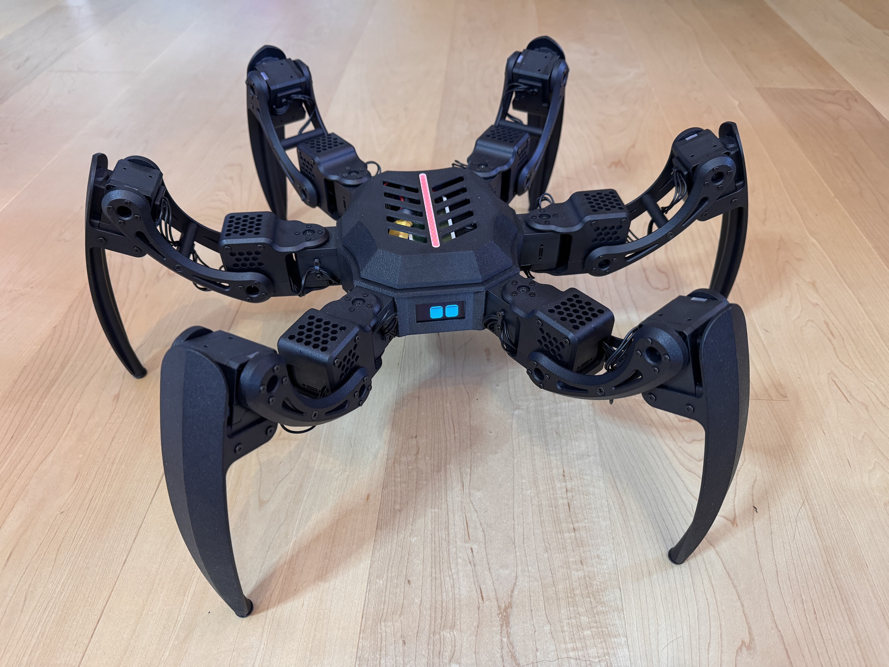

# Hexapod

A six-legged walking robot built on an ESP32-S3, driving 18 Dynamixel servos with inverse
kinematics at 200 Hz. It walks in three gaits, levels its chassis against uneven ground using
an onboard IMU, and is driven from a separate handheld transmitter over ESP-NOW.

[](https://youtu.be/4UdU5Dw7Or8)

▶ **[Watch it walk](https://youtu.be/4UdU5Dw7Or8)** - 14 seconds: leveling on planted feet,
then walking toward the camera.

## What it does

- **Inverse kinematics per leg.** Each of the six legs solves for coxa, femur and tibia angles
  from a target foot position, with targets clamped to the reachable workspace.
- **Three walking gaits** - tripod, tetrapod and ripple - selected on the fly, with step
  length, step height and ground clearance adjustable from the transmitter while walking.
- **Self-levelling.** `LevelGait` reads the IMU and counters chassis tilt so the body stays
  level on uneven ground while the feet stay planted.
- **Posing.** With the feet planted the chassis can be translated and rotated in roll, pitch
  and yaw, independently of the legs.
- **Animated face.** A 128x64 OLED shows eyes that track the joystick, blink, and change mood
  with the robot's state. It doubles as the fault display when something fails at startup.
- **Sound and lights.** I2S audio for startup, shutdown and error tones, and a 19-LED strip
  whose effect follows the state machine.
- **Power awareness.** Servo torque is released automatically after a period of inactivity,
  and the robot parks itself if the radio link drops.

## Hardware

| Part | What | Notes |
| --- | --- | --- |
| Controller | Custom ESP32-S3 board | 16 MB flash, 8 MB PSRAM; see [`hardware/`](hardware) |
| Servos | 18x Dynamixel XC430-T240BB-T | 3 joints per leg; one half-duplex bus at 3 Mbaud, protocol 2.0 |
| IMU | MPU6050 | I2C, shares the bus with the display |
| Display | SH1106 128x64 OLED | I2C, monochrome |
| LEDs | 19x WS2812B | single data line |
| Audio | I2S DAC / amplifier | 44.1 kHz, 16-bit stereo |
| Transmitter | [Separate handheld unit](https://github.com/forgevolt/Transmitter) | ESP-NOW, WiFi channel 1 |

### Wiring

`software/Hexapod/PinMap.h` is the single source of truth for every GPIO; this table mirrors
it. The schematic is in [`hardware/schematic.pdf`](hardware/schematic.pdf).

| Function | Signal | GPIO |
| --- | --- | --- |
| Dynamixel | RX | 18 |
| Dynamixel | TX | 17 |
| Dynamixel | direction | 16 |
| I2C (display + IMU) | SDA | 8 |
| I2C (display + IMU) | SCL | 9 |
| I2S (audio) | BCLK | 14 |
| I2S (audio) | LRC / word select | 21 |
| I2S (audio) | DOUT | 13 |
| LED strip | data | 11 |
| On/off switch | input | 48 |
| USB sense | input | 10 |

## Repository layout

| | |
|---|---|
| [`software/`](software) | The firmware sketch, plus the bring-up and calibration sketches |
| [`hardware/`](hardware) | PCB: EasyEDA project, Gerbers, schematic, bill of materials |
| [`mechanics/`](mechanics) | Chassis and legs: Fusion source, STLs, dimensioned drawings |
| [`docs/`](docs) | Photographs, the manuals, and the inverse-kinematics write-up |

Each of those has its own README.

### Manuals

| | |
|---|---|
| **[Quick guide](docs/QUICKSTART.md)** | One page, for anyone handed the robot. Controls, what the lights mean, what is normal |
| **[Operating manual](docs/MANUAL.md)** | The full version: servo setup, every control in every mode, timeouts, troubleshooting |

## Getting started

1. Install the required libraries (see **Libraries** below).
2. Open `software/Hexapod/Hexapod.ino` in the Arduino IDE.
3. Select board *ESP32S3 Dev Module*, Flash 16 MB, PSRAM **OPI PSRAM** (8 MB).
4. Partition Scheme: **Custom**.
5. Upload.

`software/Hexapod/partitions.csv` sits in the sketch folder, and the ESP32 core picks it up
in preference to the Tools menu: a 6 MB application partition plus a 9.8 MB LittleFS
partition. Nothing in the firmware writes to that filesystem today, but the space is
reserved.

Before the robot will walk, the servos need IDs and a baud rate set, and each leg needs its
joint limits read off - [`software/DynamixelUtilities/`](software/DynamixelUtilities) exists
for exactly that, and the order to run them in is in that folder's README.

## Building

Built with the **Arduino IDE**, using the **esp32 core 3.3.11** (IDF v5.5.5). It does not
compile against core 2.x.

### Libraries

Install through the Arduino library manager. These are the versions it is built and tested
against:

| Library | Version | Note |
| --- | --- | --- |
| FastLED | 3.10.5 | |
| Dynamixel2Arduino | 0.8.1 | |
| MPU6050_light | 1.2.1 | by rfetick - several MPU6050 libraries exist, this is the one used here |
| U8g2 | 2.36.19 | |
| Streaming | 6.3.0 | |
| [SoundEngine](https://github.com/forgevolt/SoundEngine) | 1.0.0 | I2S mixing and the compiled-in clips |
| [ESPNowUtilities](https://github.com/forgevolt/ESPNowUtilities) | 1.0.0 | the ESP-NOW transport `RCProtocol.h` is built on |

The last two are written for this project and its transmitter. Both are in the Arduino
Library Manager, so nothing here needs installing by hand.

`software/Hexapod/RCProtocol.h` defines the wire format, and it is **a copy**: the master
lives in the transmitter repository, because the format follows the transmitter's hardware.
Arduino cannot include across sketch folders, hence the duplication. `cAppProtocolVersion`
is the guard - both ends check it on every frame, so a copy that has fallen behind shows up
as a logged mismatch at pairing rather than as silently misread data.

### Compiler warnings

`software/Hexapod/build_opt.h` re-enables one warning class that the esp32 core suppresses
by default:

```
-Wsign-compare
```

The core's `cpp_flags` passes `-Wno-sign-compare` before `-Wall -Wextra` is appended, and a
specific `-Wno-` beats a later umbrella flag. Arduino expands `build_opt.h` after
`cpp_flags`, which is why overriding it there works. Delete the file and that class silently
disappears from the build.

## How it runs

Four FreeRTOS tasks, deliberately split across cores so that nothing can delay servo timing:

| Task | Priority | Core | Rate | Does |
| --- | --- | --- | --- | --- |
| `schedulerTask` | 8 | 1 | 200 Hz | the control loop: gait step, IK, servo write |
| `linkTask` | 3 | 0 | - | ESP-NOW send and receive |
| `peripheralsTask` | 2 | 1 | 50 Hz | IMU read, display and LED updates |
| `fillBuffer` | 1 | 1 | - | mixes and queues the next audio chunk (owned by SoundEngine) |

The display and the IMU share one I2C bus, owned exclusively by `peripheralsTask` - it is the
only task that may touch either. The display runs the bus at 800 kHz and U8g2 does not
restore the previous clock, so the task pulls it back to 400 kHz before every IMU read,
since the MPU6050 is not rated above that.

## Acknowledgements

**Zenta (Kåre Halvorsen)** - the GOAT of hexapods. Years of his work set the bar for what a
legged robot should look like when it moves.
[GitHub](https://github.com/Zenta) · [YouTube](https://www.youtube.com/@ZentaRobotics)

**Design inspiration**

- **Matt Bunting** - [[1]](https://youtu.be/xLxrb_P6N7o) [[2]](https://youtu.be/CVHd2_NUgIs)
- **naoa nya** - [kumokun](https://github.com/naoanya/kumokun/) · [video](https://youtu.be/WcUX7GgypG0)

**Inverse kinematics**

- **Jakob Leander**, *Master Inverse Kinematics for Arduino Robots - Easy Math, Full Code,
  Real Results*. [Video](https://youtu.be/WAsMAeKDc4U) ·
  [Code](https://github.com/JakobLeander/hexapod). The derivation in `Leg.cpp` follows this
  tutorial; [`docs/`](docs) works it through for this geometry.

**Dennis Hoelscher** - [RoboEyes](https://github.com/FluxGarage/RoboEyes), the idea behind
the animated face. `StatusDisplay` was written from a description of the behaviour rather
than from that source; the acknowledgement is in its header.

## Licence

MIT - see [LICENSE](LICENSE). Third-party library licences are listed in
[THIRD_PARTY.md](THIRD_PARTY.md).
