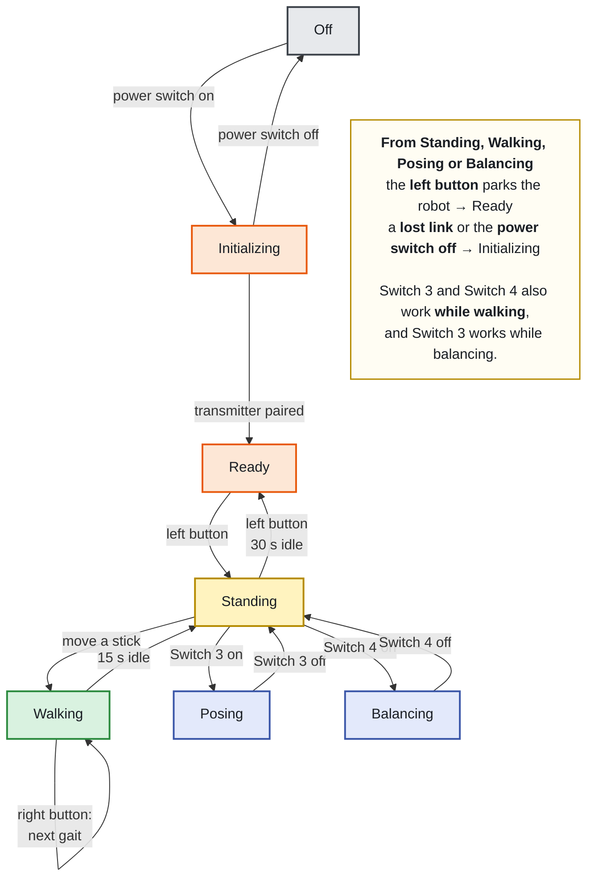

# Operating manual

How to drive the hexapod. This assumes the robot is built, the servos have their IDs and baud
rate, and both it and the transmitter are flashed. For building and setup, see the
[top-level README](../README.md) and [`software/README.md`](../software/README.md).

Everything below is behaviour of `software/Hexapod/`. Where a number matters it is named, so
you can find and change it.

- [First-time setup](#first-time-setup)
- [Controls at a glance](#controls-at-a-glance)
- [Starting up](#starting-up)
- [The five things it does](#the-five-things-it-does)
- [Walking](#walking)
- [Tuning the gait while walking](#tuning-the-gait-while-walking)
- [Posing](#posing)
- [Balancing](#balancing)
- [Reading the robot](#reading-the-robot)
- [Timeouts and what stops on its own](#timeouts-and-what-stops-on-its-own)
- [When something is wrong](#when-something-is-wrong)

## First-time setup

Done once, per robot. A Dynamixel leaves the factory as **ID 1 at 57600 baud**, so eighteen
new servos are eighteen devices with the same address — they have to be given identities one
at a time before they can share a bus.

The sketches for this are in [`software/DynamixelUtilities/`](../software/DynamixelUtilities).
Each talks to the servo bus and nothing else, so you can run them on the assembled controller
board with the rest of the robot inert.

> **Connect exactly one servo while setting its baud rate and ID.** Both sketches scan the bus
> and write to whatever they find. With a whole bus connected, all eighteen end up identical —
> which is the state you started from, only now at the wrong baud rate too.

### 1. Baud rate — `SetBaudRate/`

The firmware runs the bus at **3,000,000 baud**. The sketch scans 9600 through 4.5 M, finds
the servo whatever speed it is at, and moves it to `cTargetBaudRate` — already 3000000, so
there is nothing to edit unless you are changing the bus speed itself.

### 2. ID — `SetID/`

The sketch finds the servo, then prompts on the serial monitor: type the new ID and press
enter. The scheme is **tens digit = leg, units digit = joint**:

| | Coxa | Femur | Tibia |
|---|---|---|---|
| **Right front** | 11 | 12 | 13 |
| **Right middle** | 21 | 22 | 23 |
| **Right rear** | 31 | 32 | 33 |
| **Left front** | 41 | 42 | 43 |
| **Left middle** | 51 | 52 | 53 |
| **Left rear** | 61 | 62 | 63 |

Right side is 1–3, left side is 4–6, front to rear in both cases. This table is the one in
`Hexapod.cpp` (`cServoConfig`); if you renumber, that is the place to change it, and a
`static_assert` will catch a table with the wrong number of entries.

### 3. Mechanical zero — `DefaultPosition/`

Sends **2048** — the centre of the 12-bit range, and 0° to the kinematics — to every servo on
the bus, and holds it. **Assemble each joint with the servo held at 2048**, so that the horn
sits where the maths assumes it does.

This is the step that decides whether the robot stands straight. A joint assembled one spline
tooth off is a permanent angular offset the firmware has no way to know about.

### 4. The transmitter

Its joysticks and IMU are calibrated from its own menu (Switch 1), and the settings are stored
in the transmitter, not the robot. See the
[transmitter repository](https://github.com/forgevolt/Transmitter). Uncalibrated sticks show
up as a robot that drifts with the sticks centred.

Nothing needs pairing by hand — the two ends find each other on their own.

## Controls at a glance

The transmitter shows a label for each switch and button, sent by the robot, so the screen is
always the authority. This is what those labels mean.

| Control | Label | Does |
|---|---|---|
| **Switch 1** | *(blank)* | Opens the transmitter's own menu. The robot ignores it |
| **Switch 2** | `Adjust Gait` | Hold: the right stick tunes step length, height and ground clearance instead of steering |
| **Switch 3** | `Posing` | On: pose the body with the feet planted |
| **Switch 4** | `Balance` | On: the robot levels itself against the ground |
| **Left button** | `Standup` / `Park` | Stands up from parked, or parks from anything else |
| **Right button** | `Change Gait` | While walking, cycles tripod → tetrapod → ripple |

A button label is **blank whenever the button does nothing** — during a stand-up or park
transition, for instance. That is deliberate feedback, not a fault.

### Sticks while walking

| Axis | Two-joystick transmitter | One-joystick transmitter |
|---|---|---|
| Left X | strafe left / right | strafe left / right |
| Left Y | forward / backward | forward / backward |
| Left Z (twist) | — | **turn** (yaw) |
| Right X | **turn** (yaw) | — |
| Right Y | ride height, springs back to centre | — |
| Right Z (twist) | — | — |

The two variants differ in exactly one place: yaw comes from the left stick's twist axis on
the one-joystick transmitter and from the right stick's X axis on the two-joystick one. The
robot picks the mapping from the device type the transmitter announces at pairing — there is
nothing to configure.

Speed is not a separate control. **How far you push the stick sets how fast the gait cycles**,
between `cMinDurationMS` and `cMaxDurationMS`. Push gently and it walks slowly.

## Starting up

1. **Switch on.** The on/off switch feeds servo power. Until it is on, the robot sits in its
   off state with torque released, the display blank and the LEDs dark.
2. **The startup sound plays** and the legs fold to the parked position, taking about 3 s
   (`cParkDurationMs`).
3. **The LEDs pulse red** and the eyes look tired. The robot is waiting for the transmitter.
4. **Pairing happens by itself.** The robot broadcasts, the transmitter answers. Once frames
   are flowing the eyes open to their normal state and the robot is ready.
5. **Press the left button** (`Standup`) to stand.

Nothing needs to be switched on in a particular order. If the transmitter is already on when
the robot boots, pairing completes as soon as the robot is up.

## The five things it does

Internally these are states, and they explain why a control sometimes does nothing.

| State | How you get there | What it is |
|---|---|---|
| **Off** | on/off switch off | Torque released, display blank |
| **Initializing** | power on, or the link drops | Legs folding to parked; controls ignored |
| **Ready** | parked, transmitter paired | On the ground, waiting. `Standup` available |
| **Standing** | left button from Ready | Legs deployed, chassis level, ready to walk |
| **Walking** | move a stick from Standing | Gait running |
| **Posing** | Switch 3 | Feet planted, body moves |
| **Balancing** | Switch 4 | Feet planted, robot levels itself |

Walking, posing and balancing all return to Standing when you release what put you there.
The left button parks from any of them.

The same machine with the guards, gaits and constants from `Hexapod.cpp` is in
[`state-machine-detail.md`](state-machine-detail.md).

**Transitions cannot be interrupted, and presses during one are dropped rather than queued.**
A park takes 3 s; acting on a button pressed three seconds ago is not what you would expect,
so both button labels go blank until the robot is ready to listen again.

## Walking

From Standing, **any stick movement starts walking** — there is no separate command. Push the
left stick and it goes.

Three gaits, cycled with the right button while walking:

| Gait | Character |
|---|---|
| **Tripod** | Three legs at a time. Fastest, least stable |
| **Tetrapod** | Two at a time. A good default |
| **Ripple** | One at a time. Slowest, most stable, best on rough ground |

The gait change takes effect at the end of the current cycle, not instantly — the robot
finishes the step it is in. The transmitter shows the current gait as `Gait Type`.

Release the sticks and the gait runs out its remaining phase and stops with the feet down. It
does not freeze mid-step.

## Tuning the gait while walking

**Hold Switch 2** (`Adjust Gait`) and the right stick stops steering and starts tuning. The
three values change while you hold the stick over and stay where you leave them:

| Axis | Tunes | Effect | Range |
|---|---|---|---|
| Right X | Step length | How far each foot travels — stride | 20–150 mm |
| Right Y | Ground clearance | Ride height. Up raises the body | 60–150 mm |
| Right Z (twist) | Step height | How high a foot lifts in swing | 40–70 mm |

All three are clamped to their configured ranges, and the transmitter shows the live values as
`Step Length`, `Clearance` and `Step Height`. Steering is disabled while Switch 2 is held —
yaw is explicitly zeroed, so the robot walks straight while you tune.

**Ground clearance behaves differently depending on the switch.** With Switch 2 held, the
right stick's Y axis *sets* the tuned value and it persists. Without it, the same axis only
*trims* — centring the stick springs the body back to the tuned height. That is why you can
duck under something without losing your ride-height setting.

While Switch 2 is held, the robot ignores the idle timeout. You can take as long as you like.

## Posing

**Switch 3 on**: the feet plant and the body moves independently of them.

| Axis | Moves the body |
|---|---|
| Left X | sideways |
| Left Y | forward / backward |
| Left Z (twist) | up / down |
| Right X | roll |
| Right Y | pitch |
| Right Z (twist) | yaw |

**With Switch 4 also on, roll and pitch come from the transmitter's own tilt instead of the
right stick.** Tilt the transmitter and the body follows it. Rotation is clamped to the same
limits as stick control, so it cannot be driven further than the legs allow.

All pose motion is heavily filtered — roughly a second to settle for translation, ¾ of a
second for rotation. It will feel soft rather than immediate; that is intentional, to keep the
servos gentle.

Turn Switch 3 off and the robot stands back up.

## Balancing

**Switch 4 on** (with Switch 3 off): `LevelGait` reads the onboard IMU and counters chassis
tilt, so the body stays level while the feet stay planted. Put the robot on a slope, or tilt
the surface under it, and it compensates.

Correction is clamped to about 20° (`cMaxCorrection`) and smoothed on top of the IMU's own
filtering, so a jumpy reading does not produce jumpy servos.

The robot does not walk while balancing. Turn Switch 4 off to stand normally.

## Reading the robot

You can tell its state without looking at the transmitter.

### LEDs

| Effect | Means |
|---|---|
| **Pulsing red** | Initializing, Ready, or Standing — not moving |
| **Pulsing orange** | Posing or Balancing |
| **Sweeping backward** | Walking forward |
| **Sweeping forward** | Walking backward |
| **Sweeping to the middle** | Strafing or turning |
| Dark | Off — or in the walking state with the sticks centred |

The strip is mounted rotated 180°, which is why the sweep names look inverted in the source.

### Eyes

| Look | State |
|---|---|
| Blank | Off |
| Tired, still | Initializing |
| Normal, idle animation | Ready |
| Normal, larger, curious | Standing |
| Happy | Posing or Balancing |
| Focused, narrowed | Walking |

While walking the eyes track your steering stick, so they look the way the robot is being
sent. Under `Adjust Gait` they track the left stick regardless.

### The transmitter screen

Four live values from the robot: `Clearance`, `Step Length`, `Step Height` and `Gait Type`.
They are sent only when they change.

## Timeouts and what stops on its own

| After | What happens | Constant |
|---|---|---|
| 250 ms without a control frame | The link counts as lost; the robot parks | `cControlDataTimeoutMs` |
| 15 s of no stick input while walking | Returns to Standing | `cIdleTimeout` |
| 30 s standing | Parks itself | `2 × cIdleTimeout` |
| 60 s parked and idle | Servo torque released | `cWaitTimeUntilTorqueOff` |

**Torque release is not a fault.** The robot goes limp on purpose, to keep 18 servos from
cooking while nothing is happening. It re-engages on the next command.

**Losing the link parks the robot rather than freezing it.** Walk out of range, switch the
transmitter off, or flip the on/off switch mid-walk, and the legs fold to parked and the state
machine returns to Initializing. It re-pairs by itself when the transmitter comes back.

## When something is wrong

The OLED shows faults as a crossed-eye face with two lines of text, overriding the eyes.

| On screen | Means | Do |
|---|---|---|
| `SERVO INIT FAILED` / `check servo bus` | The servo bus did not come up at boot | Check power and the bus wiring. **Do not command a stand** — the state machine will still reach Ready and let you try |
| `ABNORMAL RESET` / *reason* | The last run ended in a panic, watchdog or brownout, not a clean power-off | Clears itself after 20 s. `brownout` means the supply dipped: suspect the battery or a stall |

The error tone plays alongside either.

### Symptoms without a fault message

**Nothing responds, LEDs pulsing red.** No link. The robot never left Initializing — check the
transmitter is on and that both ends are on the same protocol version. A version mismatch is
logged at pairing over USB serial.

**Buttons show blank labels and do nothing.** A transition is running. Wait ~3 s.

**It walks but will not turn.** Switch 2 is on. Yaw is disabled while tuning.

**It stands but sags, or a leg does not reach.** IK targets outside the reachable workspace are
clamped rather than refused. Connect USB and watch the serial log: unreachable targets and
clamped goals are counted and reported once a second, with the worst leg and the overshoot in
millimetres. Silence there means nothing was clamped.

**It parks itself while you are still driving.** Check the 250 ms link timeout first — brief
radio dropouts look exactly like this.

### Serial log

Connect USB and open the monitor at **115200 baud**. The robot detects the USB connection at
boot and only then waits for the port and logs verbosely; on battery it boots straight through
and logs warnings only. Every state change is printed, which is usually enough to see what it
thought you asked for.
