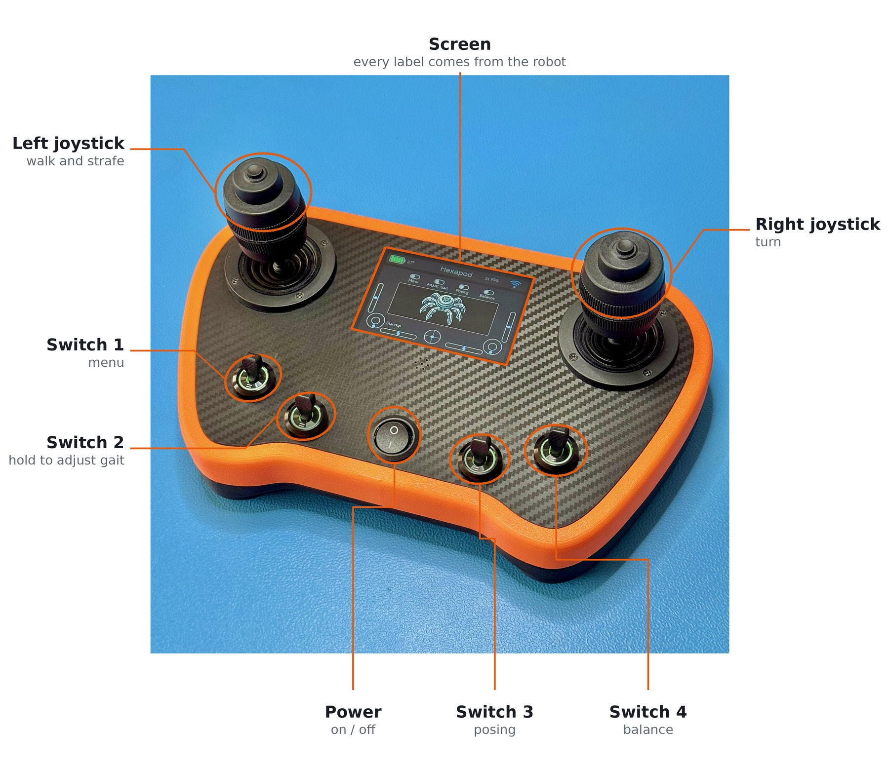

# Quick guide

How to drive the hexapod. No prior knowledge needed.

## Switch it on

Turn on the transmitter, then the robot. The robot plays a sound, folds its legs into a
resting crouch, and pulses red while it looks for the transmitter. That takes a few seconds.

When the eyes open and the transmitter shows the robot's name, it is ready.

**Press the left button** to make it stand up.

## The controls

*The two-joystick transmitter. The one-joystick version has the same switches, and you turn
by twisting the single stick.*

The transmitter labels every switch and button, and those labels change with what the robot
can do right now. A blank label means that control does nothing at the moment.

| Control | Does |
|---|---|
| **Left button** | Stand up, or lie back down |
| **Right button** | Change the walking style |
| **Switch 2** — *Adjust Gait* | Hold to change how it walks (see below) |
| **Switch 3** — *Posing* | Feet stay put, the body moves |
| **Switch 4** — *Balance* | The robot keeps itself level |

## Walking

Once it is standing, **just push the left stick**. There is no separate "go" command.

- **Forward and back**, **left and right**: the left stick
- **Turning**: the right stick sideways, or — if your transmitter has only one stick —
  twist that stick

**How far you push decides how fast it walks.** Push gently for a slow walk. Let go and it
finishes its step and stops.

The **right button** cycles through three walking styles while it walks:

- **Tripod** — quick, moves three legs at once
- **Tetrapod** — a good all-rounder
- **Ripple** — slow and steady, one leg at a time, best on rough ground

## Changing how it walks

**Hold Switch 2** and the right stick stops steering and starts adjusting instead:

- **Sideways** — how big a stride it takes
- **Up and down** — how high it stands
- **Twist** — how high it picks its feet up

The values show on the transmitter as you change them, and they stay where you leave them.
It walks straight while you are holding Switch 2 — you cannot steer and adjust at once.

Without Switch 2 held, pushing the right stick up and down still raises and lowers the body,
but only for as long as you hold it. Useful for ducking under something.

## Posing and balancing

**Switch 3 — Posing.** The feet stay planted and the body moves on top of them. The left
stick shifts it around and up and down; the right stick tilts and turns it. Movements are
deliberately soft and slow.

*A trick:* with Switch 3 and Switch 4 both on, tilt the **transmitter itself** and the robot's
body copies you.

**Switch 4 — Balance.** The robot feels which way is down and keeps its body level, even if
the ground is not. Stand it on a slope and it will straighten up. It does not walk while
doing this.

Turn the switch off and it goes back to standing normally.

## What it is telling you

**The lights:**

| | |
|---|---|
| Pulsing red | Standing by, not moving |
| Pulsing orange | Posing or balancing |
| Running along the body | Walking — the direction follows where it is going |

**The eyes:** tired while starting up, curious while standing, narrowed and focused while
walking, happy while posing or balancing. They follow the stick as you steer.

## Things that are normal

**It goes limp after a while.** If it sits parked and unused for a minute, it relaxes its
joints so the motors do not overheat. Any command wakes it up again.

**It lies down on its own.** Left standing with nothing to do for half a minute, it parks
itself.

**It parks when you switch the transmitter off** — or when you walk out of range. It stands
by and re-connects on its own as soon as the transmitter is back.

**Buttons go blank for a few seconds.** It is standing up or lying down, and will not take
new commands until it has finished.

## If something is wrong

The robot shows faults on its own screen, as a crossed-eye face with a line of text, along
with a warning sound.

| It says | Meaning |
|---|---|
| **SERVO INIT FAILED** | The legs did not respond at startup. Switch it off and check that servo power is connected. **Do not ask it to stand.** |
| **ABNORMAL RESET** | The last run ended badly rather than being switched off. It clears itself after twenty seconds. If it says *brownout*, the battery is probably low |

**Nothing responds and it keeps pulsing red.** It has not found the transmitter. Check the
transmitter is on and paired.

**It walks but will not turn.** Switch 2 is on — steering is off while you are adjusting.
