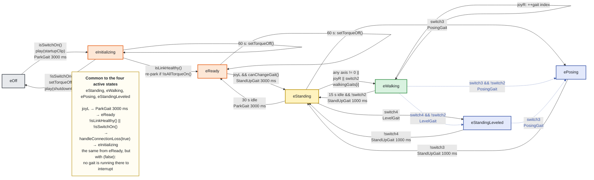

# State machine — firmware view

Every state, guard, gait and timeout in `software/Hexapod/Hexapod.cpp`. For the same machine
in operating terms, see [the manual](MANUAL.md#the-five-things-it-does).

The Mermaid below is the source. [`state-machine-detail.svg`](state-machine-detail.svg) is the
same diagram exported for printing - **if you change one, change the other.**



## Guards

`isLinkHealthy()` = `isPaired()` **and** `timeSinceLastControlData()` ≤ 250 ms. The two are
deliberately independent: the first is the transport layer's opinion, the second is the
control loop's own, and it catches a stalled WiFi task that would never clear the peer.

`canChangeGait()` gates every handler **except** `stepWalking()`. A state change from walking
therefore takes effect immediately while the gait switch is deferred to the end of the cycle;
the destination handler's own entry gate covers the gap.

## Constants

All in `Hexapod.cpp`.

| | |
|---|---|
| `cParkDurationMs` | 3000 |
| `cStandUpFromParkedMs` | 3000 |
| `cStandUpDeployedMs` | 1000 |
| `cIdleTimeout` | 15000 |
| `cWaitTimeUntilTorqueOff` | 60000 |
| `cControlDataTimeoutMs` | 250 |

## Regenerating the SVGs

Both SVGs are built with graphviz from the sources in [`diagrams/`](diagrams), then composed
so the note sits below the graph - `dot` lays nodes out by rank and cannot place a note
underneath a left-to-right graph on its own.

```
cd docs/diagrams
./build.sh          # needs graphviz and python3
```
